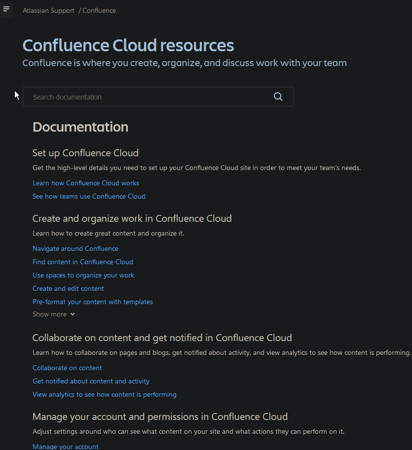

# Pro's and cons of tools documentation <!-- omit in toc -->

- [Confluence & Jira](#confluence--jira)
  - [Pro's](#pros)
  - [Cons](#cons)
- [MadCap Flare](#madcap-flare)
  - [Pro's:](#pros-1)
  - [Cons](#cons-1)

## Confluence & Jira

Jira's and Confluence documentation is similarly structured due to the fact that it comes from the same company, so it would follow that their documentation follows similiar styleguide. Therefore I decided to review their documentation together.

### Pro's
Confluence documentation, similar to Madcap's is very well structured. Multiple topics, clearly divided into subcategories that allow to swiftly find whatever is needed at a glance.

Moreover if well structure was not enough, there is a searchbar for a situation when you are searching for specific topic. That looks like a great advantage and a great addition.

Inside articles on right side you can find links to other articles in the same group.

Quickstart in tool itself is a great additon and nice way of keeping documentation/tutorial handy for users while using the tool itself instead of forcing them onto another screen.

![quickstart]<!-- quickstart image>

### Cons

## MadCap Flare

### Pro's:

Madcap's documentation is very clearly structured. 
They use interactive table of contents that is visible all the time while browsing, moreover it expands the bigger topics and divides them into smaller chunks, that are hiperlinked. This provided quick and easy access to necessary information that one might be looking for. There is no need to read all of it if you are looking only for one specific piece of information.

On tutorial topic documentation provides time approximation of how much time it may take to go through it.

Task topics use ordered lists to provide clear and concise information.
They also use images to make it easier to figure out the software, you can follow the writing as well as check images for reference.

### Cons

Staggering amount of information.
Multiple levels of trees in table of contents can be daunting for new users.

