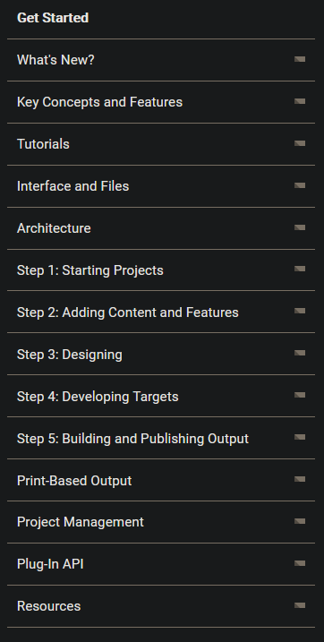
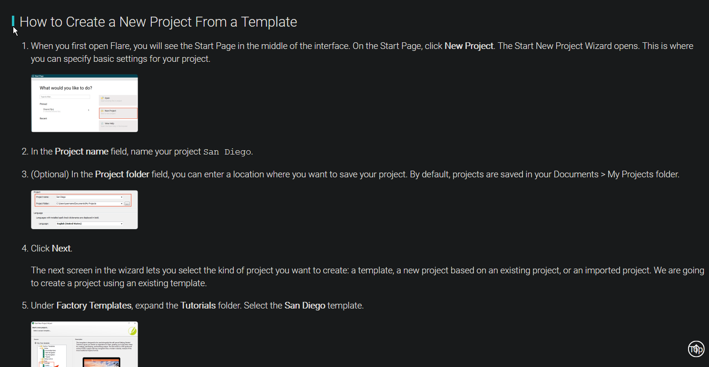
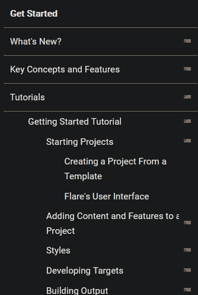
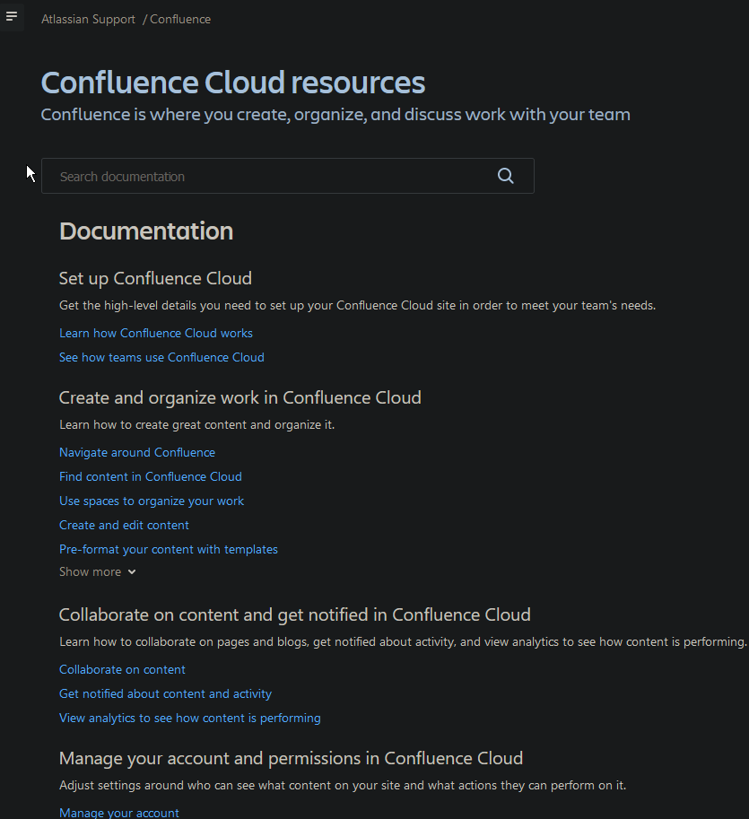

# Pro's and cons of tools documentation <!-- omit in toc -->

- [## MadCap Flare](#-madcap-flare)
  - [Pro's:](#pros)
  - [Cons](#cons)
- [## Confluence & Jira](#-confluence--jira)
  - [Pro's](#pros-1)
  - [Cons](#cons-1)

## MadCap Flare
---

### Pro's:

Madcap's documentation is very clearly structured. 
They use interactive table of contents that is visible all the time while browsing, moreover it expands, the bigger topics are divided into smaller chunks, that are hiperlinked. This provided quick and easy access to necessary information that one might be looking for. There is no need to read all of it if you are looking only for one specific piece of information.

On tutorial topic documentation provides time approximation of how much time it may take to go through it.

Task topics use ordered lists to provide clear and concise information.
They also use images to make it easier to figure out the software, you can follow the writing as well as check images for reference.

### Cons

Staggering amount of information.
Multiple levels of trees in table of contents can be daunting for new users.

## Confluence & Jira
---

Jira's and Confluence documentation is similarly structured due to the fact that it comes from the same company, so it would follow that their documentation is created in similiar style. Therefore I decided to review their documentation together.

### Pro's
Confluence documentation, similar to Madcap's is very well structured. Multiple topics, clearly divided into subcategories that allow to swiftly find whatever is needed at a glance.

Moreover if well structure was not enough, there is a searchbar for a situation when you are searching for specific topic. That looks like a great advantage and a great addition.

Inside articles on right side you can find links to other articles in the same group.

Quickstart in tool itself is a great additon and nice way of keeping documentation/tutorial handy for users while using the tool itself instead of forcing them onto another screen.

### Cons

The fact that both Confluence and Jira use similar layout and style is both a pro as a con. It makes it very easy to get lost in documentation. Furthermore the documentation is very detailed, again this is both a good thing and a bad thing. The more user uses the tool, and makes use of documentation, the better he will become in navigating it and using it to its full potential. But I can easily see new users of both of these tools being overwhelmed with information.

